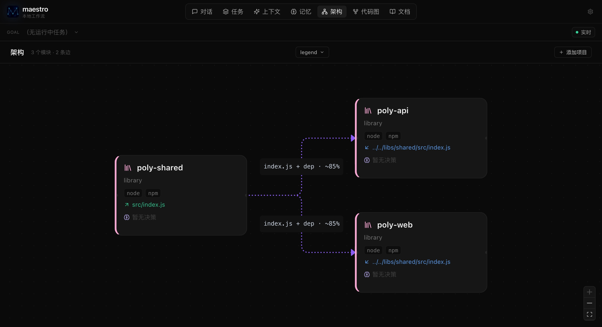
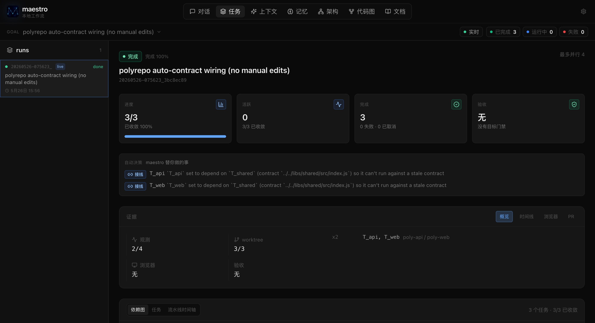
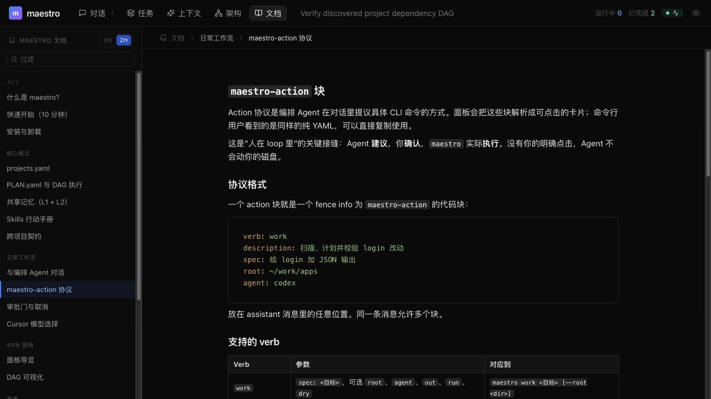
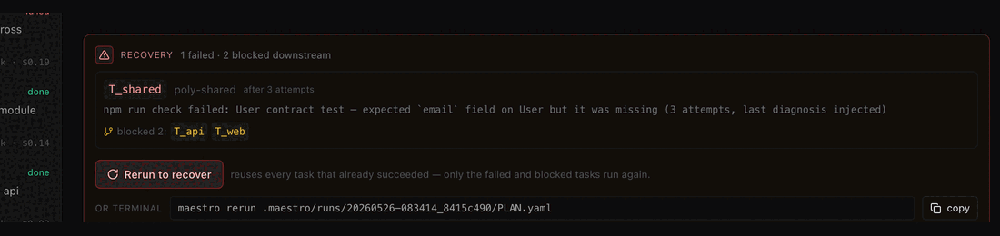
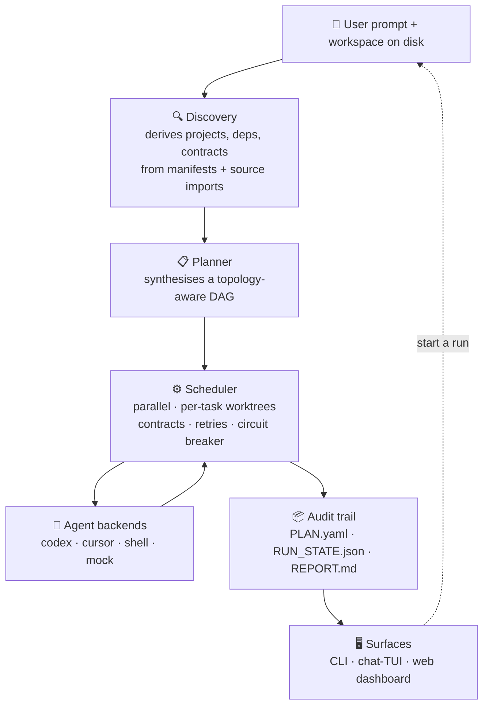

<p align="center">
  
</p>

<h1 align="center">Repo Maestro</h1>

<p align="center">
  <strong>The multi-repo workflow orchestrator.</strong>
</p>

<p align="center">
  When a change spans backend, frontend, CLI, and shared contracts,<br/>
  Repo Maestro plans and runs it as an auditable DAG —<br/>
  for monorepos, polyrepos, and mixed workspaces.
</p>

<p align="center">
  <em>The CLI is <code>maestro</code> (alias <code>mst</code>).</em>
</p>

<p align="center">
  <a href="README.md">English</a> ·
  <a href="README.zh-CN.md">中文</a>
</p>

<p align="center">
  <a href="https://github.com/AnranS/repo-maestro/actions/workflows/ci.yml"></a>
  <a href="LICENSE"></a>
  <a href="Cargo.toml"></a>
  <a href="#project-status"></a>
  
  
</p>

<p align="center">
  <a href="#quick-start">Quick start</a> ·
  <a href="#why-repo-maestro">Why Repo Maestro</a> ·
  <a href="#how-it-works">How it works</a> ·
  <a href="#documentation">Docs</a> ·
  <a href="#contributing">Contributing</a>
</p>

---

<p align="center">
  
</p>

### What Repo Maestro does that a single coding agent doesn't

- 🔀 **Auto-discovers the dependency graph** across your projects from
  manifests *and* source imports, then runs tasks in topological order.
- 🛑 **Contract-aware pauses** — consumer tasks wait for their producer to
  integrate, then receive the producer's *actual* updated contract content
  (not a description) in the next prompt.
- 🔁 **Resumable, auditable runs** — every run produces `PLAN.yaml`,
  `RUN_STATE.json`, `REPORT.md`; one-click rerun reuses what passed and
  re-runs only what blocked.
- 🛡 **Governed, not just dispatched** — risk gates pause contract-touching
  changes for approval, an adversarial *refute* pass hunts for what the
  writer missed, and a reaction engine routes CI failures / reviews back
  into the loop or escalates to a human.
- 🌱 **Learns on your terms** — opt-in, failed runs distill into reusable
  *guardrail* proposals and verified complex runs into *playbook* drafts;
  nothing changes behavior until you `maestro learn promote` one into a skill
  (deterministic, no LLM, auditable).

[**Quick start ↓**](#quick-start) · [**Why Repo Maestro ↓**](#why-repo-maestro) · [**See it in action ↓**](#see-it-in-action)

---

## What is Repo Maestro?

Repo Maestro runs **a change across multiple repos as a governed,
dependency-ordered workflow**. Each step lands as an auditable task in a DAG —
planned, contract-aware, verified, and recoverable — instead of being buried in
a single agent's chat log.

It is built for one trigger — **a dependency-aware multi-project change**:

- A monorepo with many packages (pnpm / npm / Cargo workspaces) where
  package-level tasks can run in parallel once their local deps are satisfied.
- A monorepo plus a few native repos that share the same contract.
- Several independent repos (backend · frontend · worker · CLI · mobile)
  that need a coordinated rollout.

If you only have one repo and one surface, **do not use Repo Maestro** — pick
a plain coding agent. See [Why Repo Maestro](#why-repo-maestro) for the comparison.

## Why Repo Maestro

Repo Maestro is the **orchestration layer** above your coding agents — not
their replacement, and not a general workflow engine.

| You're already using | Reach for it for | Reach for **Repo Maestro** when |
|---|---|---|
| Cursor · Codex · Claude Code · Aider · Cline | Single-repo, single-surface coding | A change has to land in ≥ 2 projects in the right order |
| LangGraph · CrewAI · custom workflow engine | Building bespoke multi-agent flows | You want a thin runner over real repos with contracts, not a framework |
| Nx · Lerna · Rush · Turborepo | Task running across a monorepo | You also have polyrepo or mixed workspaces and want AI-agent awareness |
| A hosted multi-user team server | Centralised collaboration | You're an individual or small team that wants state to stay local |
| Pure chat-driven coding | Quick one-off edits | You want a DAG, contracts, and auditable runs to back every change |

Repo Maestro is intentionally narrow. The surface area you'll touch day to
day is `maestro work`, `maestro run`, `maestro open`, and the dashboard.
Lower-level commands remain available for debugging and manual runs.

### What it looks like in practice

A change that has to land in a shared library, the CLI that consumes it, and the docs:

| Without Repo Maestro | With Repo Maestro |
|---|---|
| Manually order N repos, open N PRs, track state in your head | One prompt: Repo Maestro discovers the dependency graph and plans the DAG |
| Consumer change written against your *memory* of the contract; conflicts at integration | Consumer task waits for producer to integrate, then receives the **real updated contract** in its prompt |
| Each failure unwinds by hand across N branches | One-click rerun reuses what passed; re-runs only what blocked |
| "Did anyone update repo X yet?" lives in chat | `REPORT.md` + the audit DAG show what ran, what's pending, what failed |

## Quick start

**Prebuilt binary** (no Rust toolchain needed; ships only the compiled binary):

```bash
curl -fsSL https://github.com/AnranS/maestro-dist/releases/latest/download/install.sh | sh
```

This installs `maestro` (and the `mst` alias) to `~/.local/bin`. See
[`scripts/install.sh`](scripts/install.sh) for env knobs (`MAESTRO_INSTALL_BASE`,
`MAESTRO_BIN_DIR`, `MAESTRO_VERSION`).

**From source** (needs Rust 1.82+ and Node/pnpm to build the embedded UI):

```bash
# 1. Build the embedded web dashboard. The Rust crate's release path
#    embeds web/dist/, so this step MUST run before any cargo command.
#    --frozen-lockfile keeps installs reproducible; the
#    --config.dangerously-allow-all-builds flag lets pnpm 10+ approve
#    esbuild's install script non-interactively (without this, pnpm
#    silently skips the build and Vite can't bundle).
pnpm -C web install --frozen-lockfile --config.dangerously-allow-all-builds=true
pnpm -C web build

# 2. Build the binary. --features codegraph enables the tree-sitter
#    code-graph engine (small extra build cost, big payoff for cross-
#    project topology).
cargo install --path . --features codegraph

# 3. Seed the workspace and run a zero-config demo plan end-to-end.
maestro setup
maestro demo --run
```

Either way you get the `maestro` binary; then generate the workspace
scaffolding and run a self-contained demo plan end-to-end.

Then point it at your real projects:

```bash
maestro init --analyze --root ~/work/projects --agent codex
maestro work "Add JSON output to the calculator CLI" \
  --root ~/work/projects --agent codex --run
maestro open    # open the dashboard
```

See [Run on your own projects](#run-on-your-own-projects) for the full path
including `--dry` and approval gates.

## See it in action

The hero clip above runs a zero-config two-task shell DAG end-to-end — no LLM
credentials required. Rebuild the recording with `./scripts/record-demo.sh`.

### Dashboard

| Topology graph | Run + automatic actions | Action protocol |
|---|---|---|
|  |  |  |
| Contracts and dependencies detected from disk — edges **inferred from source imports** are dashed with a confidence score. | Task status plus an **"automatic actions" ledger**: what Repo Maestro wired, retried, or escalated on your behalf. | Chat agents propose actions; nothing runs without an approval card. |

### Chat-TUI (terminal)

`maestro tui` opens a full **interactive terminal frontend** in the spirit of
codex / claude-code — j/k task navigation, slash commands, chat with the
orchestrator, **inline action cards** (press `y` / `n`), a **diff side-panel**
(`d`), and a live banner meter for **tokens spent** + **context bytes
injected**. The chat session is shared with the WebUI `/chat` tab — open
both and they stay in sync.

| Phase | Surface | Key shortcuts |
|---|---|---|
| Dashboard | TASKS sidebar / detail / `d` for diff vs HEAD | `j` `k` / `g` `G` / `r` refresh |
| Slash commands | `:` or `/` → `/approve [task]`, `/cancel`, `/logs`, `/rerun`, `/replay` | `a` approve selected · `c` prefill cancel |
| Chat | streaming answer with **dim 💭 thinking trace** above + markdown styling | `Tab` enter chat · `Enter` send · `y`/`n` decide pending action · `PageUp`/`Down` scroll |

`mst tui --classic` keeps the old line-printer dashboard for terminals that
can't handle ratatui's alternate-screen mode; `mst tui --once` is the
CI-friendly one-shot dump. Both auto-engage when stdin/stdout isn't a TTY,
so piping `mst tui | head` keeps working.

### Trust, cost & recovery

<p align="center">
  
</p>

When a run fails, the dashboard shows **what failed, what it blocked, and a
one-click "Rerun to recover"** (reuses succeeded tasks; re-runs only the failed
and blocked ones). Every run carries a **cost breakdown** — tokens and $ by
project and by agent, against your `--max-tokens` budget — and the runs sidebar
plots a **cross-run trend** that flags any run costing more than 2× the median.

## Features

- **Dependency-aware scheduling** — petgraph-based DAG with parallelism,
  approval gates, cancellation, and per-task git worktree isolation.
- **Automatic topology + contract inference** — discovery derives inter-project
  dependencies from manifests **and source imports**, and promotes imported
  files to `provides`/`consumes` contracts. No hand-written wiring required.
- **Contract-aware orchestration** — consumers are auto-wired to run after their
  producers (no race), and a downstream agent's prompt is injected with the
  producer's *actual* (just-integrated) contract content, not a description.
- **Resilient recovery** — bounded retries with a circuit breaker that stops
  re-running an identical failure, and **escalation** (event + notification +
  actionable callout) when Repo Maestro gives up so a human can step in.
- **Automatic-decision observability** — every wiring, retry, circuit-break, and
  integration conflict is recorded in a per-run ledger, surfaced in `REPORT.md`,
  the run-end summary, notification channels, and the dashboard.
- **Monorepo *and* polyrepo** — per-repo worktree isolation across separate git
  roots, a workspace bridge for unified cross-directory verification, and
  context scoped to each project's subtree to keep prompts small.
- **Multiple task backends** — Codex, Cursor, shell, and a mock adapter for
  deterministic tests.
- **Project-scoped skills and memory** — agents stay inside the intended
  workflow; memory fan-in follows the dependency topology.
- **Auditable runs** — every run produces `PLAN.yaml`, `RUN_STATE.json`,
  `REPORT.md`, and per-task logs on disk.
- **Zero-config onboarding** — bare `maestro` suggests the next command for your
  workspace state; `maestro init` discovers and registers projects in one step.
- **Built-in dashboard** — embedded web UI for the topology graph, DAG runs,
  the automatic-actions ledger, chat actions, and docs.
- **Channel adapter** — bidirectional integration with chat tools (e.g.
  Feishu) so a prompt in chat becomes a run, and run events stream back.

### Trust, cost & recovery controls

- **Review-not-rubber-stamp approvals** — an approval gate shows the task's
  **real diff and a risk verdict** (high if it touches a contract, deletes
  files, or sprawls), so a gate is a decision, not a reflexive click.
- **Receipts on every task** — each task links to *what changed* (files +
  branch + on-demand diff), kept on disk so it's auditable after the run.
- **Plan preview with blast radius** — `maestro work` / `run --dry` print, per
  task, which contracts it touches and how many downstream tasks it can affect,
  before anything executes.
- **Cost visibility + budget gate** — per-task and per-run tokens/$, a
  per-project / per-agent breakdown, a cross-run trend that flags anomalies, and
  a `--max-tokens` budget that escalates and stops a runaway run.
- **One-command failure recovery** — a failed run surfaces the blocked
  downstream and a one-click rerun that reuses succeeded work.
- **Zero-token architecture brief** — `maestro brief` summarizes how the
  workspace fits together (types, contracts, dependency flow) without an LLM.
- **Parallel-agent lanes** — a swimlane view groups tasks by project so you can
  see which agents are working concurrently, alongside the dependency DAG.

## How it works



Each layer is a thin module with a stable shape: discovery is read-only,
the planner produces an inspectable `PLAN.yaml`, the scheduler is the only
component that mutates files (always inside a per-task git worktree), and
every surface reads the same audit trail.

## Benchmarks

Repo Maestro is benchmarked against real open-source multi-package PRs and a
contract-break gauntlet:

| Suite | Pass rate | Last updated |
|---|---|---|
| OSS replay (5) |  | pending first scheduled run |
| Contract break (10) |  | pending first scheduled run |

See `bench/scenarios/` for fixtures and `docs/lessons/` for postmortems.
Badge generation is intentionally a placeholder in
`scripts/refresh-bench-badge.sh` until the first benchmark history format is
locked.

### Project registry

`.maestro/projects.yaml` is the source of truth for local projects:

```yaml
version: 1
defaults:
  agent: codex
  max_parallel: 4

projects:
  codex-lab-core:
    path: .maestro/codex-workflow-lab/core
    type: library
    stack: [node, npm]
    agent: codex
    contracts:
      provides: contract/calculator.contract.json

  codex-lab-cli:
    path: .maestro/codex-workflow-lab/cli
    type: library
    stack: [node, npm]
    agent: codex
    contracts:
      consumes: ../core/contract/calculator.contract.json
    dependencies: [codex-lab-core]
```

### Generated plan

`maestro work` emits a plain `PLAN.yaml` so the lower-level runner is always
available when you want manual control:

```yaml
spec: "Add JSON output to the calculator CLI"
created_by: maestro-work

tasks:
  - id: T_change_codex_lab_core
    project: codex-lab-core
    skills: [workflow-task-guardrails, verify-before-done, contract-first]

  - id: T_change_codex_lab_cli
    project: codex-lab-cli
    depends_on: [T_change_codex_lab_core]
```

### Chat actions

The chat surface is deliberately narrow. Agents may propose only these
verbs: `work` · `run` · `approve` · `status` · `rerun` · `plan_validate`.

````markdown
```maestro-action
verb: work
description: Scan, plan, and validate JSON output
spec: Add JSON output to the CLI
root: ~/work/projects
agent: codex
dry: true
```
````

The dashboard renders the block as an approval card; nothing runs until the
user confirms.

## Run on your own projects

Pick a workspace. It does not need to contain the projects themselves:

```bash
mkdir -p ~/work/maestro-demo
cd ~/work/maestro-demo
maestro init        # discovers + registers projects, then prints the next step
# (interactive: also offers to build a dependency-verification DAG)
```

`maestro init` discovers and registers projects by default — even
non-interactively — and always ends with a state-aware "next" hint. Pass
`--bare` for pure scaffolding (no discovery), or `--analyze` to additionally
scan, assign the agent, and emit a dependency-ordered audit plan (review tasks
are instructed not to modify files):

```bash
maestro init --analyze --root ~/work/projects --agent codex --out plans/init-dag.yaml
maestro plan validate plans/init-dag.yaml
maestro run plans/init-dag.yaml --dry
```

Scan, plan, and validate a real change:

```bash
maestro work "Add JSON output to the calculator CLI" \
  --root ~/work/projects --agent codex
```

| Mode | Command | Use when |
|---|---|---|
| Validate only | `maestro work "<goal>" --root <dir>` | You want the plan path before running. |
| Dry run | `maestro work "<goal>" --root <dir> --dry` | You want to inspect every task prompt without spending agent calls. |
| Execute | `maestro work "<goal>" --root <dir> --run` | You're ready to dispatch the DAG. |

Open the dashboard:

```bash
maestro open                                 # auto-launch
maestro ui --host 127.0.0.1 --port 7777      # keep server in foreground
```

## Try on an example monorepo

```bash
cd examples/monorepo-pnpm
cargo run --manifest-path ../../Cargo.toml -- work "demo goal" --root . --dry
```

Two pnpm workspace packages plus an independent mobile-style package — enough
to exercise workspace discovery and local dependency edges without preparing
your own repos.

## Use from Claude Code

Repo Maestro ships a Claude Code **skill** so Claude Code can delegate
multi-repo, dependency-ordered work to maestro instead of fanning subagents
across repos it doesn't coordinate. Install it by copying the skill into your
Claude Code skills directory:

```bash
mkdir -p ~/.claude/skills
cp -R skills/repo-maestro ~/.claude/skills/
```

Once installed, Claude Code reaches for it when a change spans **multiple
repos/projects in dependency order** (a shared contract change plus its
consumers, a monorepo plus sibling repos). It stays out of the way for
single-repo edits. The skill drives the `maestro` CLI — discover → plan
(`--dry`) → show you the blast radius → run on your approval — it never edits
your repos directly. See [`skills/repo-maestro/SKILL.md`](skills/repo-maestro/SKILL.md).

## Documentation

- 📖 **[Full bundled docs](docs/site/)** — searchable book (English + 中文)
  covering overview, install, concepts, CLI, dashboard, and troubleshooting.
  Also reachable in the running dashboard at `maestro open` → Docs tab.
- [Concepts](docs/concepts.md) — the 8 core terms (provider · adapter · agent ·
  role · skill · mode · `model_profile` · `agent_profile`).
- [Workspace layout reference](#workspace-layout)
- [CLI reference](#cli-reference)
- [Examples](examples/) — monorepo + multi-repo fixtures.
- [Changelog](CHANGELOG.md) — notable changes per release.
- [Contributing](CONTRIBUTING.md) — dev setup, branching, PR conventions.

## Requirements

- Rust toolchain to build this repository (`cargo install --path .`).
- At least one task backend: `codex`, `cursor-agent`, `shell`, or `mock`.
- Local projects on disk. `maestro work --root` discovers projects from the
  folder you point it at.

## Workspace layout

<details>
<summary><strong>Click to expand</strong> — files Repo Maestro writes under <code>.maestro/</code></summary>

```text
.maestro/
├── projects.yaml         # source of truth for projects + deps
├── memory/
│   ├── l1_facts/
│   └── l2_decisions/
├── skills/
│   ├── _global/
│   └── <project>/
├── runs/
│   ├── current -> <latest-run>
│   └── <run-id>/
│       ├── PLAN.yaml
│       ├── RUN_STATE.json
│       ├── REPORT.md
│       ├── dry/             # rendered task prompts (--dry mode)
│       └── logs/            # per-task adapter logs
├── chat/
│   └── sessions/
└── control/
    ├── approvals/
    └── cancels/
```

</details>

## CLI reference

<details>
<summary><strong>Click to expand</strong> — every <code>maestro</code> subcommand</summary>

```text
# Main workflow
maestro work "<goal>" [--root <dir>] [--agent codex] [--dry] [--run]

# Workspace
maestro setup
maestro init [--analyze | --no-analyze] [--root <dir>] [--agent codex] [--max-depth N] [--out <plan.yaml>]
maestro add <path> [--name <id>] [--type <kind>] [--stack a,b] [--agent codex]
maestro ls
maestro rm <name>
maestro validate

# Plans and runs
maestro plan validate <plan.yaml>
maestro run <plan.yaml> [--dry] [--only ids] [--skip ids] [--max-parallel N]
maestro rerun <run-id> [--from task_id]
maestro approve <task_id>
maestro cancel-run [run-id]

# Observe
maestro status
maestro runs
maestro logs <task-id> --follow
maestro providers
maestro open
maestro ui --port 7777
maestro tui [--run <id>]        # interactive chat-tui (default when TTY)
maestro tui --classic            # classic auto-refreshing line printer
maestro tui --once               # one-shot snapshot, CI / scripts

# Context
maestro memory ls
maestro skill ls
maestro skill update qa-web-flow
maestro skill sync

# Docs
maestro doc
maestro doc ls --lang zh
maestro doc show cli --lang zh

# Channels (Feishu / chat integration)
maestro channels listen --once --from-stdin
maestro channels listen --poll [--channel <name>] [--poll-limit N] [--interval-secs N]
maestro channels drain --run-dir <path> [--once | --watch]
```

</details>

## Contributing

Contributions are welcome. See [CONTRIBUTING.md](CONTRIBUTING.md) for the
dev setup, branching and PR conventions, and the TDD norms for the
scheduler / channel adapter / plan synth modules.

By participating you agree to abide by the
[Code of Conduct](CODE_OF_CONDUCT.md). For security issues, please follow
[SECURITY.md](SECURITY.md) and do **not** open a public issue.

## Project status

Repo Maestro is in **beta**. The public surface is intentionally small:
`maestro work` is the primary workflow; lower-level commands stay available
for debugging and controlled manual runs. The local-first stance is a
deliberate constraint, not a missing feature — if you need hosted multi-user
execution today, this is not the project.

## License

[MIT](LICENSE).
