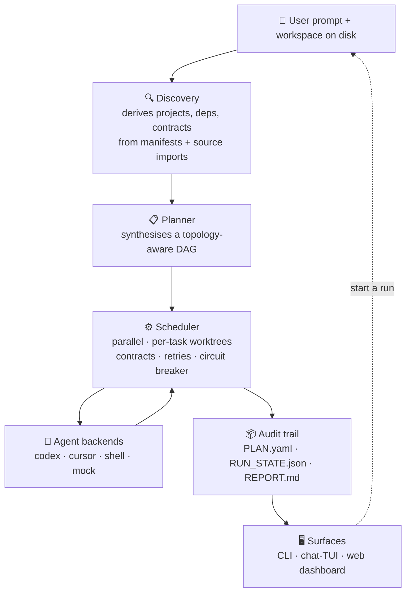

<p align="center">
  
</p>

<h1 align="center">Repo Maestro</h1>

<p align="center">
  <strong>多仓工作流编排器。</strong>
</p>

<p align="center">
  当一次改动横跨后端、前端、CLI 和共享契约时，<br/>
  Repo Maestro 把它规划并执行为可审计的 DAG —<br/>
  覆盖 monorepo、polyrepo 与混合 workspace。
</p>

<p align="center">
  <em>CLI 仍叫 <code>maestro</code>（别名 <code>mst</code>）。</em>
</p>

<p align="center">
  <a href="README.md">English</a> ·
  <a href="README.zh-CN.md">中文</a>
</p>

<p align="center">
  <a href="LICENSE"></a>
  <a href="Cargo.toml"></a>
  <a href="#项目状态"></a>
  
  
</p>

<p align="center">
  <a href="#快速开始">快速开始</a> ·
  <a href="#为什么用-repo-maestro">为什么用 Repo Maestro</a> ·
  <a href="#工作原理">工作原理</a> ·
  <a href="#文档">文档</a> ·
  <a href="#贡献">贡献</a>
</p>

---

<p align="center">
  
</p>

### 单 agent 做不到的四件事

- 🔀 **跨项目自动发现依赖图** — 从 manifest 与源码 import 同时推断，然后按拓扑顺序执行任务。
- 🛑 **契约感知的暂停** — consumer 任务会等到 producer 集成完成，下一条 prompt 里收到 producer **真实更新后的契约内容**（不是描述）。
- 🔁 **可恢复、可审计的运行** — 每次 run 产出 `PLAN.yaml`、`RUN_STATE.json`、`REPORT.md`；一键 rerun 复用通过的任务，只重跑失败和被阻塞的。
- 🛡 **是治理，不只是分发** — 风险门让碰契约的改动先过人审，对抗式 *refute* pass 专找作者漏掉的东西，reaction engine 把 CI 失败 / review 意见接回循环或升级给人。
- 🌱 **会学习，且由你做主** — 可选开启后，失败的 run 蒸馏成可复用的 *guardrail* 提议、通过验证的复杂 run 蒸馏成 *playbook* 草稿；在你 `maestro learn promote` 把它变成 skill 之前，什么行为都不会改变（确定性、无 LLM、可审计）。

[**快速开始 ↓**](#快速开始) · [**为什么用 Repo Maestro ↓**](#为什么用-repo-maestro) · [**实际效果 ↓**](#实际效果)

---

## Repo Maestro 是什么

Repo Maestro 把**一次改动跨多个仓库跑成一条受治理的、按依赖顺序的工作流**。每一步都作为 DAG 里的可审计任务存在 —— 规划、契约感知、验证、可恢复 —— 而不是埋在某个 agent 的聊天记录里。

它只为一种触发条件而生 — **依赖感知的多项目变更**：

- 一个包含多个 package 的 monorepo（pnpm / npm / Cargo workspace），满足本地依赖后可以并行运行 package 级任务。
- 一个 monorepo 加几个共享同一契约的原生仓库。
- 几个独立仓库（后端 · 前端 · worker · CLI · 移动端）需要协调发布。

如果你只有一个仓库一个 surface，**就不要用 Repo Maestro** — 选个普通的 coding agent 即可。详见 [为什么用 Repo Maestro](#为什么用-repo-maestro) 的对比。

## 为什么用 Repo Maestro

Repo Maestro 是跑在你的 coding agent **之上的编排层** — 不是替代它们，也不是通用 workflow 引擎。

| 你已经在用 | 它适合干 | 适合换 **Repo Maestro** 的时机 |
|---|---|---|
| Cursor · Codex · Claude Code · Aider · Cline | 单仓单 surface 写代码 | 一次改动要按顺序落在 ≥ 2 个项目上 |
| LangGraph · CrewAI · 自研 workflow engine | 自己搭多 agent flow | 你想要一个跑在真实仓库 + 契约上的薄 runner，不是框架 |
| Nx · Lerna · Rush · Turborepo | monorepo 任务运行 | 你同时有 polyrepo / 混合 workspace，并希望它感知 AI agent |
| 托管多用户团队 server | 集中协作 | 个人或小团队，希望状态保留在本地 |
| 纯聊天驱动写代码 | 一次性小改 | 你希望每次变更有 DAG、契约和可审计的 run 支撑 |

Repo Maestro 有意保持窄。日常你接触的接口就是 `maestro work`、`maestro run`、`maestro open` 和 dashboard。底层命令在调试和手动 run 时仍然可用。

### 落到实际场景

一次改动要同时落在共享库、依赖它的 CLI、以及文档：

| 不用 Repo Maestro | 用 Repo Maestro |
|---|---|
| 手工排顺序，开 N 个 PR，状态全靠脑子记 | 一条 prompt：Repo Maestro 自动发现依赖图并规划 DAG |
| 写 consumer 改动时凭**记忆**对契约，集成时一炸一个 | consumer 任务等 producer 集成完，在自己的 prompt 里收到**真实更新后的契约** |
| 每次失败都要手工跨 N 条分支收尾 | 一键 rerun 复用通过的任务，只重跑失败和被阻塞的 |
| "repo X 有人改了吗？" 飘在聊天里 | `REPORT.md` + audit DAG 显示哪步跑了、哪步阻塞、哪步失败 |

## 快速开始

**预编译二进制**（不需要 Rust 工具链；只装编译好的二进制）：

```bash
curl -fsSL https://github.com/AnranS/maestro-dist/releases/latest/download/install.sh | sh
```

会把 `maestro`（以及 `mst` 别名）装到 `~/.local/bin`。环境变量旋钮（`MAESTRO_INSTALL_BASE`、`MAESTRO_BIN_DIR`、`MAESTRO_VERSION`）见 [`scripts/install.sh`](scripts/install.sh)。

**从源码构建**（需要 Rust 1.82+ 和 Node/pnpm 来构建内嵌 UI）：

```bash
# 1. 构建内嵌的 web dashboard。Rust crate 的 release 路径会把 web/dist/ 嵌进去，
#    所以这步必须先于任何 cargo 命令。--frozen-lockfile 保持安装可复现；
#    --config.dangerously-allow-all-builds 让 pnpm 10+ 非交互地批准 esbuild
#    的 install script（否则 pnpm 会静默跳过 build，Vite 没法 bundle）。
pnpm -C web install --frozen-lockfile --config.dangerously-allow-all-builds=true
pnpm -C web build

# 2. 构建二进制。--features codegraph 启用 tree-sitter 代码图引擎
#    （额外 build 成本很小，跨项目拓扑收益很大）。
cargo install --path . --features codegraph

# 3. 生成 workspace 脚手架并端到端跑一个零配置 demo plan。
maestro setup
maestro demo --run
```

两条路径最终都给你 `maestro` 二进制；然后生成 workspace 脚手架并端到端跑一个自包含的 demo plan。

然后对准你的真实项目：

```bash
maestro init --analyze --root ~/work/projects --agent codex
maestro work "Add JSON output to the calculator CLI" \
  --root ~/work/projects --agent codex --run
maestro open    # 打开 dashboard
```

完整路径（含 `--dry` 和审批门禁）见 [在自己的项目上运行](#在自己的项目上运行)。

## 实际效果

页首的 GIF 就是零配置的两任务 shell DAG，端到端跑完不需要任何 LLM 凭证。
重录用 `./scripts/record-demo.sh`。

### 面板截图

| 架构图 | DAG Runs | Action 协议 |
|---|---|---|
|  |  |  |
| 从磁盘检测到的契约和项目依赖。 | 每次 run 都是带任务状态、adapter 标签、日志和历史记录的 DAG。 | Chat agent 提出动作，需要确认卡片才能执行。 |

### 信任、成本与恢复

<p align="center">
  
</p>

run 失败时，面板直接告诉你**哪个任务挂了、卡住了哪些下游、以及一键「重跑以恢复」**
（复用已成功的任务，只重跑失败和被阻断的）。每次 run 都带**成本分解**——按项目、
按 agent 的 tokens 与 $，对照 `--max-tokens` 预算——侧栏还画了**跨 run 趋势**，
任何超过中位 2× 的 run 都会标红。

## 特性

- **依赖感知调度** — 基于 petgraph 的 DAG，支持并行度、审批门禁、取消、每任务 git worktree 隔离。
- **多种任务后端** — Codex、Cursor、shell，以及用于确定性测试的 mock adapter。
- **项目级 skills 和 memory** — agent 留在预期工作流里，不在多个目录间游走。
- **可审计运行** — 每次 run 都在磁盘上产出 `PLAN.yaml`、`RUN_STATE.json`、`REPORT.md` 和按任务的日志。
- **内置 dashboard** — 嵌入式 web UI，覆盖架构图、DAG run、chat action、文档。
- **Channel adapter** — 与聊天工具（如飞书）双向集成，让聊天里的 prompt 变成 run，run 事件流回聊天。

### 信任、成本与恢复控制

- **审批是审查、不是盖章** — 审批门展示任务的**真实 diff + 风险分级**（改契约、删文件、大范围改动判为 high），让确认成为决策而非条件反射。
- **每个任务都有回执** — 每个任务链接到**改了什么**（文件 + 分支 + 按需 diff），落盘保存，跑完仍可审计。
- **带波及面的计划预览** — `maestro work` / `run --dry` 在执行前逐任务打印它碰哪些契约、能影响多少下游任务。
- **成本可见 + 预算门** — 单任务/单次 run 的 tokens 与 $、按项目/按 agent 的分解、标记异常的跨 run 趋势，以及超额即升级并停的 `--max-tokens` 预算。
- **一条命令的失败恢复** — 失败的 run 暴露被阻断的下游，并提供一键重跑（复用已成功的工作）。
- **零 token 架构速览** — `maestro brief` 不用 LLM 就总结出工作区如何拼装（类型、契约、依赖流向）。
- **并行 agent 泳道** — 泳道视图按项目分组任务，配合依赖 DAG，让你看清哪些 agent 在并行工作。


## 工作原理



每一层都是有稳定形态的薄模块：discovery 只读、planner 产出可审视的 `PLAN.yaml`、scheduler 是唯一改文件的组件（始终在 per-task git worktree 里改）、所有 surface 读同一份 audit trail。

### 项目注册表

`.maestro/projects.yaml` 是本地项目的事实来源：

```yaml
version: 1
defaults:
  agent: codex
  max_parallel: 4

projects:
  codex-lab-core:
    path: .maestro/codex-workflow-lab/core
    type: library
    stack: [node, npm]
    agent: codex
    contracts:
      provides: contract/calculator.contract.json

  codex-lab-cli:
    path: .maestro/codex-workflow-lab/cli
    type: library
    stack: [node, npm]
    agent: codex
    contracts:
      consumes: ../core/contract/calculator.contract.json
    dependencies: [codex-lab-core]
```

### 生成计划

`maestro work` 生成普通的 `PLAN.yaml`，所以当你需要手动控制时，底层 runner 仍然可用：

```yaml
spec: "Add JSON output to the calculator CLI"
created_by: maestro-work

tasks:
  - id: T_change_codex_lab_core
    project: codex-lab-core
    skills: [workflow-task-guardrails, verify-before-done, contract-first]

  - id: T_change_codex_lab_cli
    project: codex-lab-cli
    depends_on: [T_change_codex_lab_core]
```

### Chat Actions

Chat surface 有意保持窄接口。Agent 只能提议这些动词：`work` · `run` · `approve` · `status` · `rerun` · `plan_validate`。

````markdown
```maestro-action
verb: work
description: Scan, plan, and validate JSON output
spec: Add JSON output to the CLI
root: ~/work/projects
agent: codex
dry: true
```
````

Dashboard 会把这个 block 渲染成确认卡片，用户批准前不会执行任何动作。

## 在自己的项目上运行

先选一个 workspace（不需要包含项目本身）：

```bash
mkdir -p ~/work/maestro-demo
cd ~/work/maestro-demo
maestro init
# 提示时选择 y：
# Analyze projects under the current directory now? [Y/n]
```

非交互执行用 `--analyze`，会扫描目录、把 agent 写入发现到的项目、更新 `.maestro/projects.yaml`，并生成依赖有序的 audit plan（其中 review 任务被明确指示不修改文件）：

```bash
maestro init --analyze --root ~/work/projects --agent codex --out plans/init-dag.yaml
maestro plan validate plans/init-dag.yaml
maestro run plans/init-dag.yaml --dry
```

扫描、规划并校验一次真实变更：

```bash
maestro work "Add JSON output to the calculator CLI" \
  --root ~/work/projects --agent codex
```

| 模式 | 命令 | 适用场景 |
|---|---|---|
| 只校验 | `maestro work "<goal>" --root <dir>` | 想先拿到生成计划路径，不执行。 |
| Dry run | `maestro work "<goal>" --root <dir> --dry` | 想检查每个任务 prompt，避免消耗 agent 调用。 |
| 执行 | `maestro work "<goal>" --root <dir> --run` | 已准备好分发并运行 DAG。 |

打开 dashboard：

```bash
maestro open                                 # 自动启动
maestro ui --host 127.0.0.1 --port 7777      # 把 server 保持在前台
```

## 试用 monorepo 示例

```bash
cd examples/monorepo-pnpm
cargo run --manifest-path ../../Cargo.toml -- work "demo goal" --root . --dry
```

示例里有两个 pnpm workspace package 和一个独立的移动端风格 package。你可以不用准备自己的仓库，也能检查 workspace discovery 和本地依赖边。

## 文档

- 📖 **[内嵌完整文档](docs/site/)** — 可搜索的双语手册（English + 中文），覆盖
  概览、安装、概念、CLI、面板、排错。也可在面板 `maestro open` → Docs 标签查看。
- [概念](docs/concepts.md) — 8 个核心术语（provider · adapter · agent · role · skill · mode · `model_profile` · `agent_profile`）。
- [工作区结构](#工作区结构)
- [CLI 参考](#cli-参考)
- [示例](examples/) — monorepo + 多仓库 fixture。
- [Changelog](CHANGELOG.md) — 各版本的关键变更。
- [贡献指南](CONTRIBUTING.md) — 开发环境、分支策略、PR 规范。

## 要求

- Rust toolchain，用于构建本仓库（`cargo install --path .`）。
- 至少一个任务后端：`codex`、`cursor-agent`、`shell` 或 `mock`。
- 本地磁盘上的项目。`maestro work --root` 会从你指定的目录发现项目。

## 工作区结构

<details>
<summary><strong>点击展开</strong> — Repo Maestro 在 <code>.maestro/</code> 下写的文件</summary>

```text
.maestro/
├── projects.yaml         # 项目和依赖的事实来源
├── memory/
│   ├── l1_facts/
│   └── l2_decisions/
├── skills/
│   ├── _global/
│   └── <project>/
├── runs/
│   ├── current -> <latest-run>
│   └── <run-id>/
│       ├── PLAN.yaml
│       ├── RUN_STATE.json
│       ├── REPORT.md
│       ├── dry/             # --dry 模式渲染的 task prompt
│       └── logs/            # 按任务的 adapter 日志
├── chat/
│   └── sessions/
└── control/
    ├── approvals/
    └── cancels/
```

</details>

## CLI 参考

<details>
<summary><strong>点击展开</strong> — 所有 <code>maestro</code> 子命令</summary>

```text
# 主工作流
maestro work "<goal>" [--root <dir>] [--agent codex] [--dry] [--run]

# Workspace
maestro setup
maestro init [--analyze | --no-analyze] [--root <dir>] [--agent codex] [--max-depth N] [--out <plan.yaml>]
maestro add <path> [--name <id>] [--type <kind>] [--stack a,b] [--agent codex]
maestro ls
maestro rm <name>
maestro validate

# Plans and runs
maestro plan validate <plan.yaml>
maestro run <plan.yaml> [--dry] [--only ids] [--skip ids] [--max-parallel N]
maestro rerun <run-id> [--from task_id]
maestro approve <task_id>
maestro cancel-run [run-id]

# Observe
maestro status
maestro runs
maestro logs <task-id> --follow
maestro providers
maestro open
maestro ui --port 7777
maestro tui [--run <id>]

# Context
maestro memory ls
maestro skill ls
maestro skill update qa-web-flow
maestro skill sync

# Docs
maestro doc
maestro doc ls --lang zh
maestro doc show cli --lang zh

# Channels（飞书 / chat 集成）
maestro channels listen --once --from-stdin
maestro channels listen --poll [--channel <name>] [--poll-limit N] [--interval-secs N]
maestro channels drain --run-dir <path> [--once | --watch]
```

</details>

## 贡献

欢迎贡献。详见 [CONTRIBUTING.md](CONTRIBUTING.md) — 开发环境、分支策略、PR 规范，以及 scheduler / channel adapter / plan synth 模块的 TDD 要求。

参与即表示同意遵守 [行为准则](CODE_OF_CONDUCT.md)。安全问题请按 [SECURITY.md](SECURITY.md) 流程私下报告，**不要**开公开 issue。

## 项目状态

Repo Maestro 处于 **beta**。公开接口有意保持小：`maestro work` 是主工作流，底层命令在调试和受控手动 run 时仍可用。Local-first 是有意为之的约束，不是缺失的特性 — 如果你今天就需要托管多用户执行，那这不是你要找的项目。

## 许可证

[MIT](LICENSE)。
